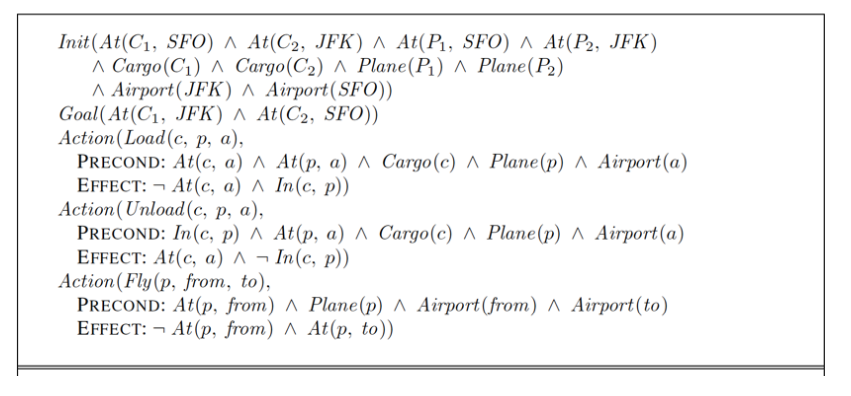

# py2pddl (Python to PDDL)

Write your planning task as Python classes, then translate
them to PDDL files. We will use PDDL 1.2 with `(:requirements :strips :typing)`, i.e.
the actions only use positive preconditions and deterministic effects, and
we use 'types' like in OOP to represent sets of objects.

The library is written with these considerations:

* **Type checking**
* To define the domain and problem as Python but yet still look similar to PDDL
* To quickly define the domain and problem using some **boilerplate**
* To define ground predicates **cleanly**
* To **reduce the use of strings** while defining ground predicates

---

* [Features](#features)
* [Requirements](#requirements)
* [Installation](#installation)
* [Quick start in 5 steps](#quick-start-in-5-steps)
* [Examples](#examples)
* [Resources](#resources)

## Features

This library allows you to define:

* Domain: requirements (strips and typing), types, predicates, action
* Problem: objects, init, goal

Negation is done using the `~` operator.

## Requirements

* Python 3.6
* [python-fire](https://github.com/google/python-fire) (`pip install fire`)

## Installation

```bash
pip install git+https://github.com/remykarem/py2pddl#egg=py2pddl
```

## Quick start in 5 steps

We will use the following air cargo problem:



### 1. Set up boilerplate

Create an `aircargo.py` file by running:

```text
python -m py2pddl.init aircargo.py
```

and enter the following:

```text
Name: AirCargo
Types (separated by space): cargo airport plane
Predicates (separated by space): plane_at cargo_at in_
Actions (separated by space): load unload fly
```

### 2. Define the domain

In the `aircargo.py` source file, the `AirCargoDomain` class has been created.
The structure of the class is similar to how a PDDL domain should be defined.

* Name of the domain is the name of the Python class (`AirCargoDomain`).
* Types are defined as class variables at the top (`Plane`, `Cargo`, `Airport`).
* Predicates are defined as instance methods decorated with `@predicate`.
* Actions are defined as instance methods decorated with `@action`.

Now, complete the class definition such that it looks like this:

```python
from py2pddl import Domain, create_type
from py2pddl import predicate, action

class AirCargoDomain(Domain):

    Plane = create_type("Plane")
    Cargo = create_type("Cargo")
    Airport = create_type("Airport")

    @predicate(Cargo, Airport)
    def cargo_at(self, c, a):
        """Complete the method signature and specify
        the respective types in the decorator"""

    @predicate(Plane, Airport)
    def plane_at(self, p, a):
        """Complete the method signature and specify
        the respective types in the decorator"""

    @predicate(Cargo, Plane)
    def in_(self, c, p):
        """Complete the method signature and specify
        the respective types in the decorator"""

    @action(Cargo, Plane, Airport)
    def load(self, c, p, a):
        precond = [self.cargo_at(c, a), self.plane_at(p, a)]
        effect = [~self.cargo_at(c, a), self.in_(c, p)]
        return precond, effect

    @action(Cargo, Plane, Airport)
    def unload(self, c, p, a):
        precond = [self.in_(c, p), self.plane_at(p, a)]
        effect = [self.cargo_at(c, a), ~self.in_(c, p)]
        return precond, effect

    @action(Plane, Airport, Airport)
    def fly(self, p, orig, dest):
        precond = [self.plane_at(p, orig)]
        effect = [~self.plane_at(p, orig), self.plane_at(p, dest)]
        return precond, effect
```

Note:

* To create a new type `Car`, simply add `Car = create_type("Car")` at the top
of the class definition.
* The positional arguments of `@predicate` and `@action` decorators
are the types of the respective arguments.
* Methods decorated with `@predicate` should have empty bodies.
* Methods decorated with `@action` return a tuple of two lists.

### 3. Define the problem

At the bottom part of `aircargo.py`, there is another class called `AirCargoProblem`.
Again, the structure of the class is similar to how a PDDL problem should be defined.

* Name of the domain is the name of the Python class (`AirCargoProblem`).
* Objects are defined as the instance attributes in the `__init__` method.
* Initial states are defined as a methods decorated with `@init`.
* Goal is defined as an instance methods decorated with `@goal`.

Complete the class definition as follows:

```python
from py2pddl import goal, init

class AirCargoProblem(AirCargoDomain):

    def __init__(self):
        super().__init__()
        self.cargos = AirCargoDomain.Cargo.create_objs([1, 2], prefix="c")
        self.planes = AirCargoDomain.Plane.create_objs([1, 2], prefix="p")
        self.airports = AirCargoDomain.Airport.create_objs(["sfo", "jfk"])

    @init
    def init(self):
        at = [self.cargo_at(self.cargos[1], self.airports["sfo"]),
              self.cargo_at(self.cargos[2], self.airports["jfk"]),
              self.plane_at(self.planes[1], self.airports["sfo"]),
              self.plane_at(self.planes[2], self.airports["jfk"]),]
        return at

    @goal
    def goal(self):
        return [self.cargo_at(self.cargos[1], self.airports["jfk"]),
                self.cargo_at(self.cargos[2], self.airports["sfo"])]
```

Note:

* The Python objects (`cargos`, `planes` and `airports`) are created using the respective
types defined in the `AirCargoDomain`. For example, `AirCargoDomain.Cargo.create_objs([1, 2], None, "c")`
will create a Python dictionary `{1: AirCargoDomain.Plane("p1"), 2: AirCargoDomain.Plane("p2")}`.
This allows cleaner access to these objects while defining initial state and goal,
which usually can get pretty messy.
* The PDDL objects defined in the `__init__` are meant to be used across
the 2 instance methods.
* Any method decorated with `@init` must return a list.
* Any method decorated with `@goal` must return a list.

### 4. Parse

* Generate the PDDL files from the command line by runnning

    ```text
    python -m py2pddl.parse aircargo.py
    ```

* You can also import the parsing function from the module

    ```python
    from py2pddl import parse
    parse("aircargo.py")
    ```

* The class itself also contains methods to generate the domain
and problem PDDL files separately. These methods were inherited from
`Domain`.

    ```python
    from aircargo import AirCargoProblem

    problem = AirCargoProblem()
    problem.generate_domain_pddl()
    problem.generate_problem_pddl()
    ```

Here is the generated `domain.pddl` file.

```text
(define
	(domain somedomain)
	(:requirements :strips :typing)
	(:types
		airport
		cargo
		plane
	)
	(:predicates
		(cargo_at ?c - cargo ?a - airport)
		(in_ ?c - cargo ?p - plane)
		(plane_at ?p - plane ?a - airport)
	)
	(:action fly
		:parameters (?p - plane ?orig - airport ?dest - airport)
		:precondition (plane_at ?p ?orig)
		:effect (and (not (plane_at ?p ?orig)) (plane_at ?p ?dest))
	)
	(:action load
		:parameters (?c - cargo ?p - plane ?a - airport)
		:precondition (and (cargo_at ?c ?a) (plane_at ?p ?a))
		:effect (and (not (cargo_at ?c ?a)) (in_ ?c ?p))
	)
	(:action unload
		:parameters (?c - cargo ?p - plane ?a - airport)
		:precondition (and (in_ ?c ?p) (plane_at ?p ?a))
		:effect (and (cargo_at ?c ?a) (not (in_ ?c ?p)))
	)
)
```

And here is the generated `problem.pddl` file.

```text
(define
	(problem someproblem)
	(:domain somedomain)
	(:objects
		sfo jfk - airport
		c1 c2 - cargo
		p1 p2 - plane
	)
	(:init (cargo_at c1 sfo) (cargo_at c2 jfk) (plane_at p1 sfo) (plane_at p2 jfk))
	(:goal (and (cargo_at c1 jfk) (cargo_at c2 sfo)))
)
```

Then use your favourite planner like [Fast Downward](https://github.com/aibasel/downward).
To output a plan. Here's the plan generated from the above PDDL:

```text
(load c1 p1 sfo)
(fly p1 sfo jfk)
(load c2 p1 jfk)
(unload c1 p1 jfk)
(fly p1 jfk sfo)
(unload c2 p1 sfo)
; cost = 6 (unit cost)
```

See more examples in the `pddl/` folder.

### 5. Generate the problems dynamically

If you want the problem PDDL to be more dynamic if you have
changing inits and goals, you could use dictionaries and
specify in the `init` or `goal` keyword argument.

```python
p.generate_problem_pddl(
    goal={"cargo": "C2"})
```

## Examples

Below are several example domains. The respective Python files, PDDL files and sas_plan files (generated using Fast Downward) can be found in the `pddl/` folder [here](https://github.com/remykarem/py2pddl/tree/master/pddl).

* [Logistics](https://github.com/pellierd/pddl4j/wiki/Logistics:-a-simple-running-example)
* [Blocks world](https://en.wikipedia.org/wiki/Blocks_world)
* [Aircargo](pddl/aircargoproblem.png)

## Resources

* [PDDL4J](https://github.com/pellierd/pddl4j)
* [Fast Downward](https://github.com/aibasel/downward)
* [Planning Wiki](https://planning.wiki)
* [IPC 2018 domains](https://ipc2018-classical.bitbucket.io/domains.html)
* [Classical domains](https://github.com/AI-Planning/classical-domains)
* [Planning domains](http://planning.domains)

---

If you use this software for your work, please cite us as follows:

```
@article{bin_Karim_py2pddl_2020,
author = {bin Karim, Raimi},
journal = {https://github.com/remykarem/py2pddl},
month = {11},
title = {{py2pddl}},
year = {2020}
}
```
